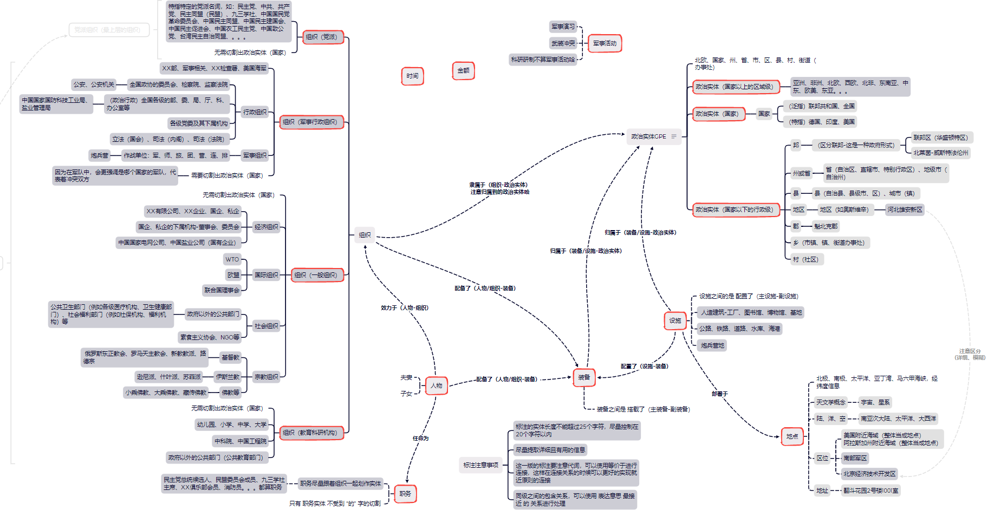

## 领域本体设计参照与数据

**ACE05-zh:** 数据源于<a href="https://catalog.ldc.upenn.edu/LDC2006T06">ACE 2005 Multilingual Training Corpus</a>，主要涉及经济、文化、社会领域，修改<a href="https://github.com/wasiahmad/ACE05-Processor">ACE05-Processor</a>从原始数据中提取领域事件模板，

**Duie2.0:** 数据源于<a href="https://aistudio.baidu.com/aistudio/competition/detail/31?isFromCcf=true">百度aistudio竞赛</a>，该数据集有48个已定义好的schema，43个简单知识schema，5个复杂知识的schema

**Fned:** 数据源于<a href="http://www.csdata.org/p/771/">csdata</a>，包含7类实体类型和8类关系类型，内容以军事政治方面的中文新闻通稿、采访报道为主

**国内外社交媒体数据:** 在Facebook等社交平台爬取近半年特定人物、组织团体、政党、政治实体的言论与新闻数据

## 领域本体设计样板

## 部分摸索路线

## 总结

参考ACE05、Duie2、fned的标注体系，围绕军事、政治、社会等方面设计领域本体，对Facebook等社交平台爬取的新闻数据（人物、政治实体、设施、武器等实体及其关系）进行标注，构建超8000条实例的领域数据集。

## Did you find this page helpful? Consider sharing it 🙌

