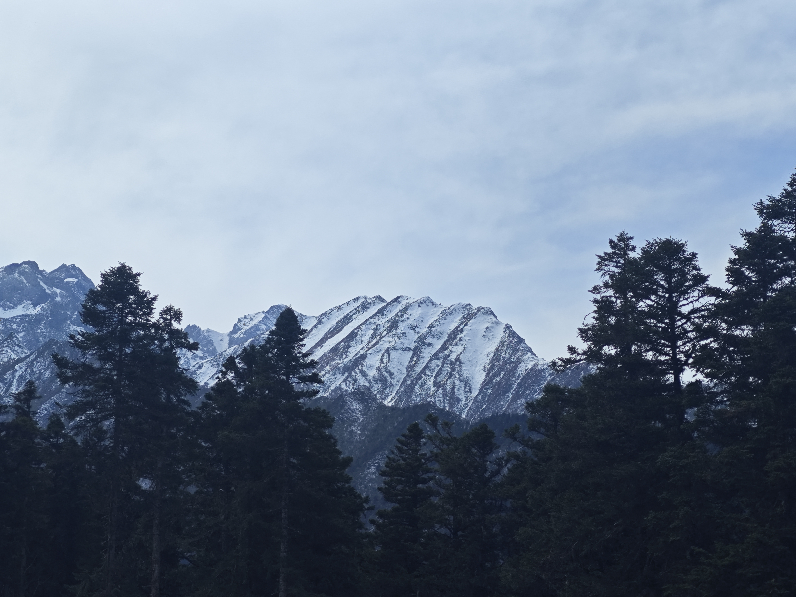

2024年1月30号前提前完成所有任务开run

## 旅行时间全览🕜

- 2024年1月30号（周二）下午3点40分到成都，大约5点左右到住宿地方（成都玉林华西亚朵酒店），晚上去吃点好吃的逛街成都市区玩
- 2024年1月31号（周三）熊猫谷-都江堰一日游
- 2024年2月1号（周四）三星堆
- 2024年2月2-5号（周五-周一）川西 - （成都-黄龙-九寨沟-达古冰川-四姑娘山）
- 2024年2月6号（周二）双流机场 - 返程

## 1月31日 - 熊猫谷-都江堰一日游

> 微信公众号：`成都景区直通车` 
> 都江堰熊猫谷+都江堰1日往返送达服务

早上8:00 春熙路->熊猫谷 （班车 - 春谷都2）

 
### 熊猫谷🦝（按照班车只能玩2小时，实际可以玩3-4小时）

- 入园时间（分上午下午门票）-> 8:00-12:00（上午） ； 12:00-16:30（下午）；17:30（闭园）

下午1:00 熊猫谷->都江堰 （班车 - 春谷都2）

### 都江堰

- 入园时间 8:00-17:00

下午17:00 都江堰->宽窄巷子（班车 - 春谷都2）

### 2月1日 - 三星堆🔔一日游

- 入园时间 8:30-18:00

推荐有讲解的比较好，

### 2月2-5日 川西🏔️

#### 物品携带📦

- 防雨防晒（我带了一把遮阳伞和一个雨衣，防晒霜你应该有带）
- 防寒保暖（棉帽子 * 1、棉手套 * 2、一次性暖手宝（买的不是很成功，感觉没啥效果，就贴在手机后面））
- 卫生（一次性床单被套 * 4、我带一次性袜子和厚袜子、衣裤、牙刷牙膏、一次性马桶垫）
- 医疗
  - 氧气瓶（清水河学校边上的天府药店18块1瓶（爱心氧））❓ 是否需要购买，不可携带到地铁上
  - 红景天（抗高反的口服液）
  - 创口贴、消毒、纸巾、湿巾

## 随手拍

