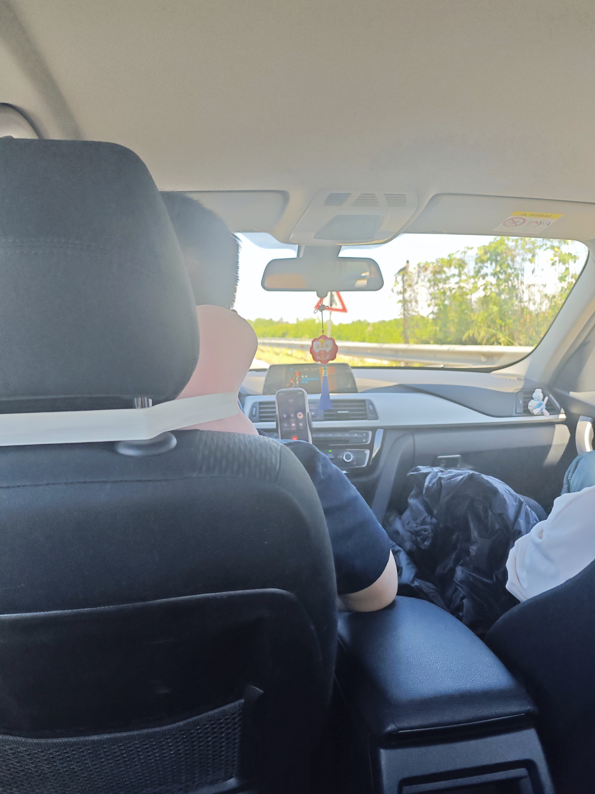
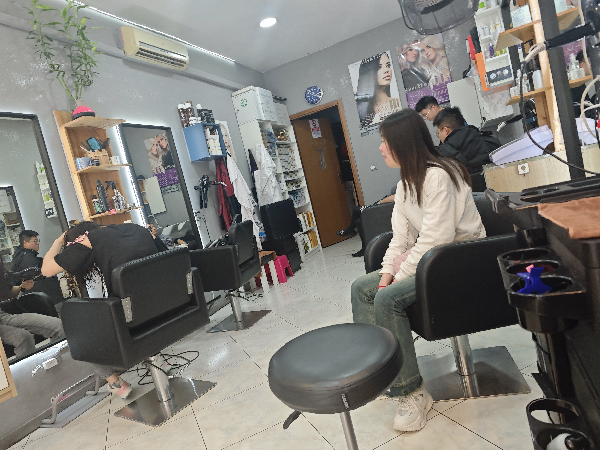
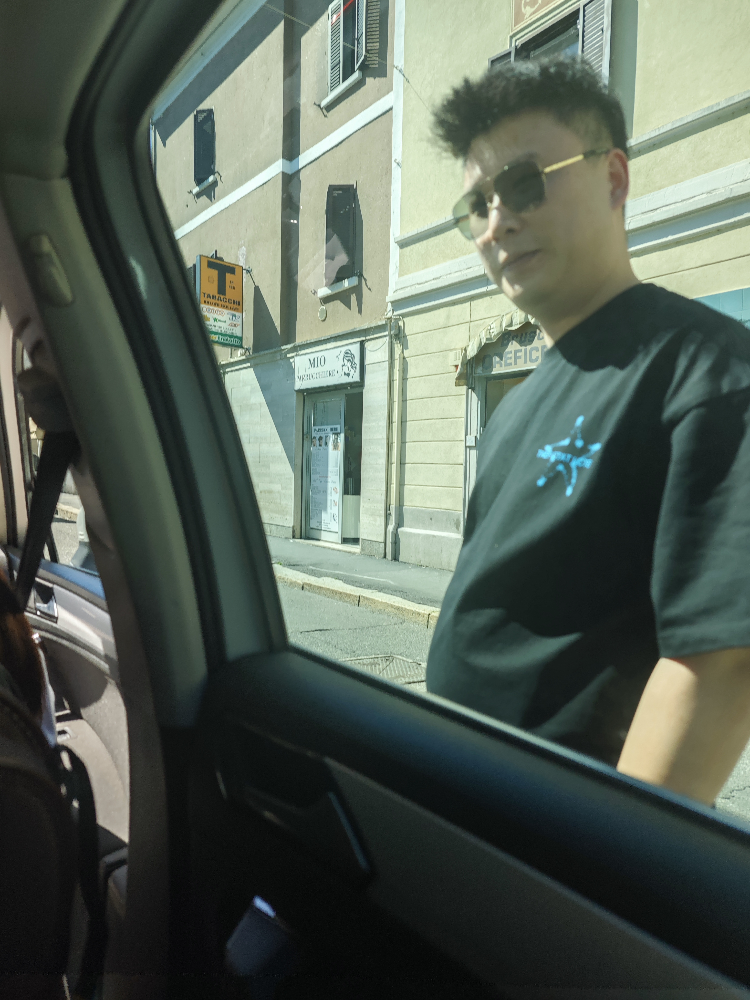
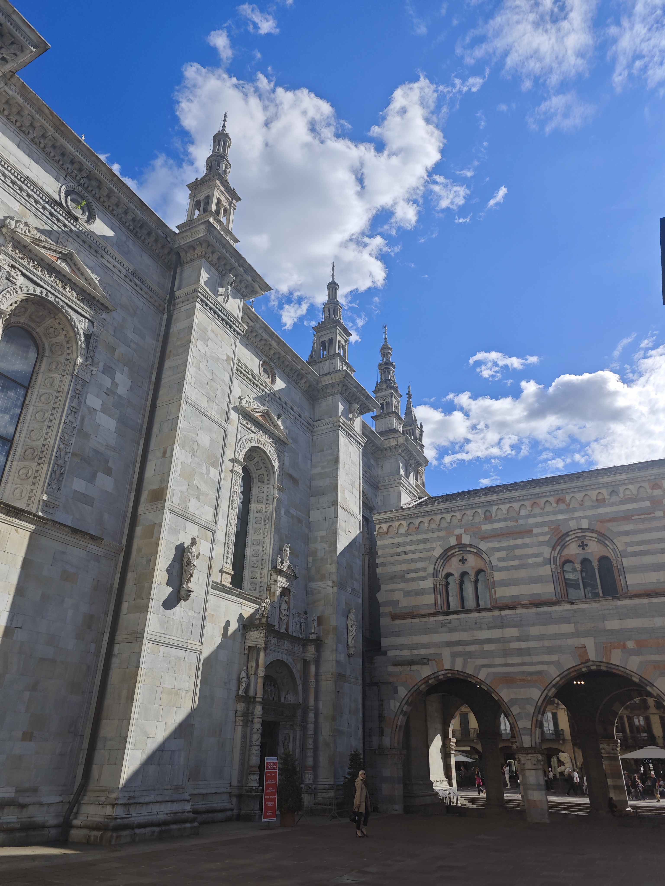
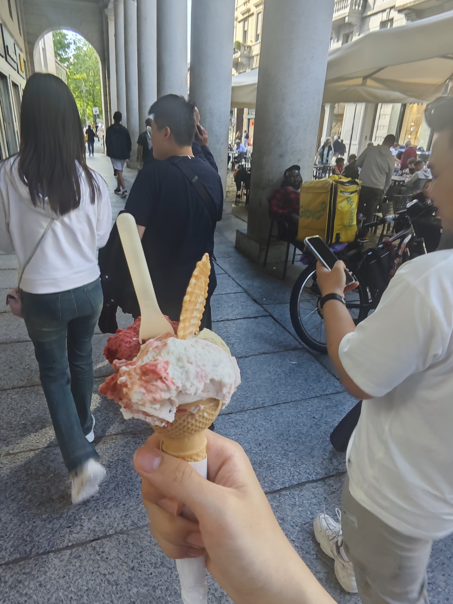
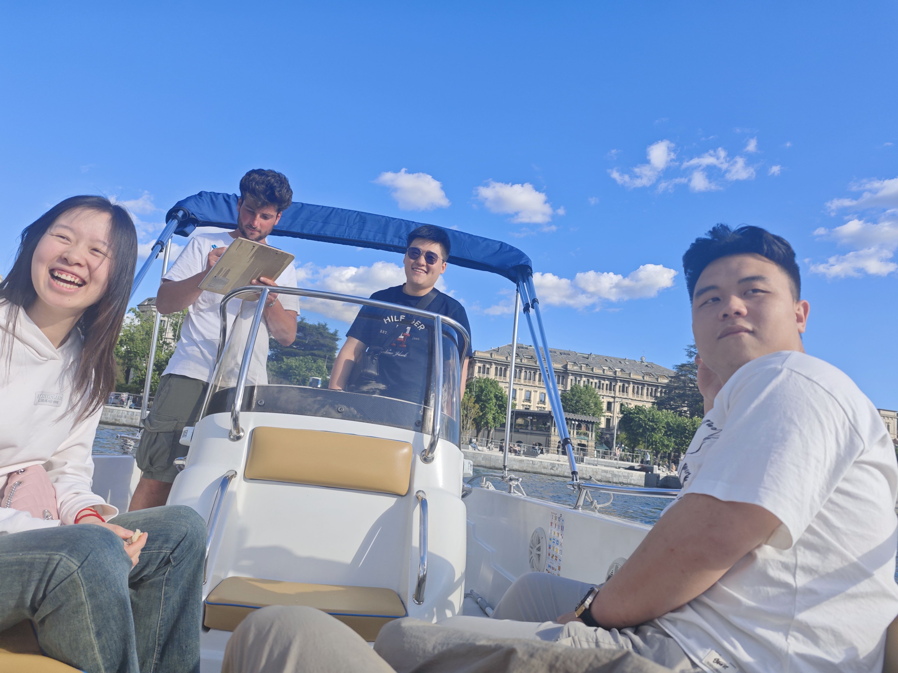
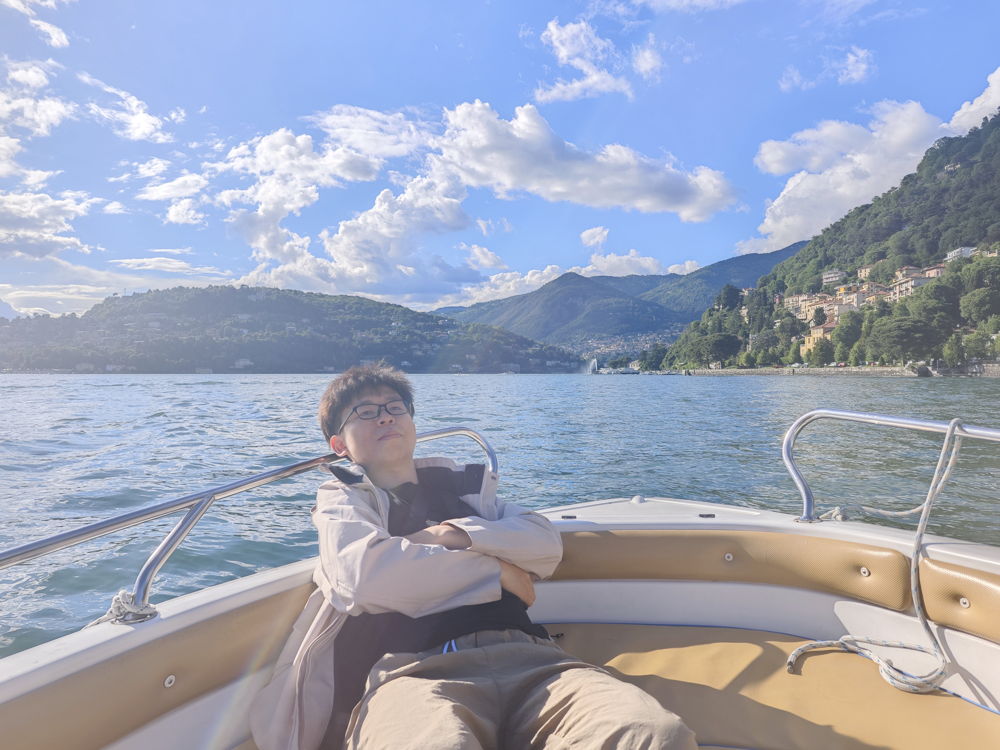
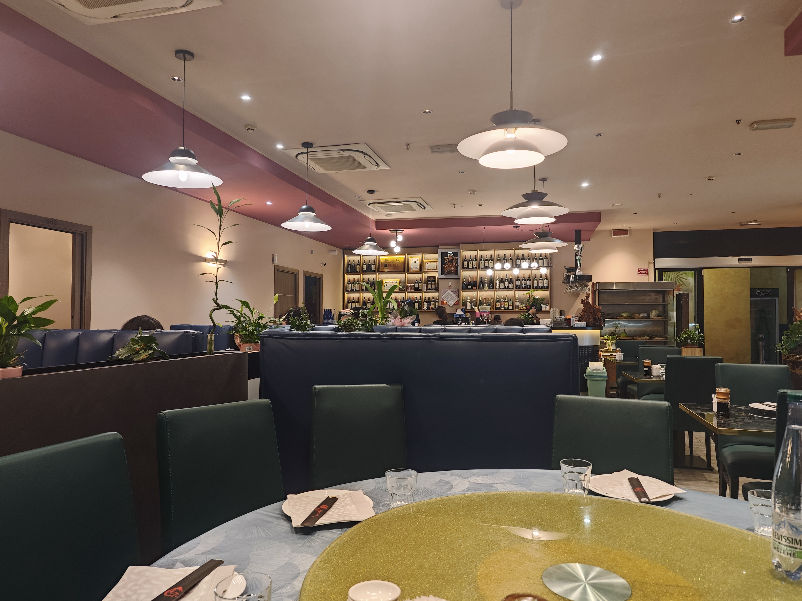

注：以下除会议相关的费用，其他开销全都由亲朋好友赞助，感谢老师和亲朋好友的支持！！！

> 17日成都出发到上海收拾行李；
> 19日上海出发-德国法兰克福转机-到达意大利都灵，到达酒店Oriana Homèl Torino，并在都灵大学附近闲逛，摸清附近的交通路线和店铺布局；

法兰克福机场

都灵交通

都灵建筑

都灵大学及周边

> 20日，从都灵坐火车到米兰，中午与堂哥碰面，下午到唐人街见堂哥的朋友，逛意大利米兰多莫（米兰的各大教堂，广场），晚上在米兰doumo教堂附近和堂哥的声乐留学生们吃韩餐。

米兰火车站

唐人街

教堂

红酒商

街景

> 21日，见另一个开餐馆的朋友，到他的餐馆吃意大利餐，等3点多他下班后，他开车带我们去科莫Como开游艇。

早餐 - 超好吃的开心果酱牛角包

街景 - 米兰小雨淅沥的清晨

坐车去找朋友

公交上那个孩子竟然在玩荒野乱斗

朋友开在米兰的二层独栋饭店（有中国厨师和当地厨师，游走于中餐和意餐间，朋友手艺不错，还会调酒）

朋友开车带我们去另一个朋友那里，他是经营理发店的，路上车子胎压异常，顺便借他的车开开，前往多莫（海滨度假城市）

多莫街景

意大利的冰淇淋很正

岸边喂鸽子的老人

开游艇去啦

晚上回到米兰市区中餐馆大聚餐

22日，回到都灵，准备演讲稿和材料，到达会场Centro Congressi Lingotto，观摩学习（oral+poster），熟悉汇报环境。
23日，到达会场，正式汇报

