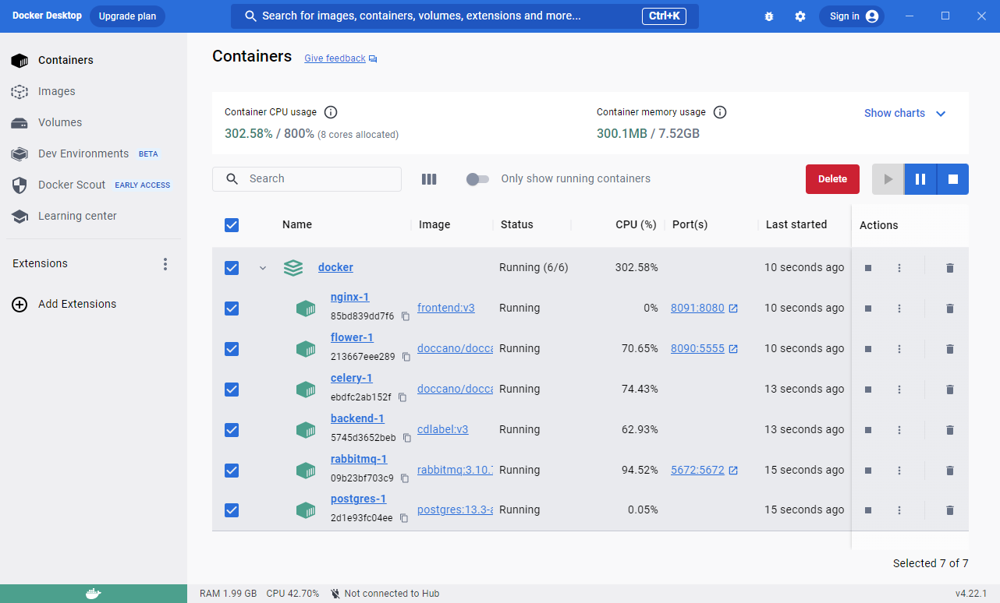
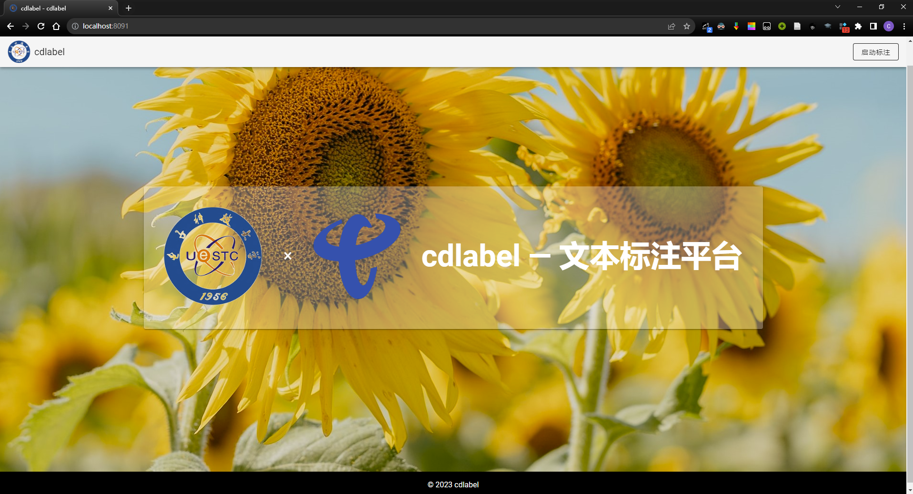
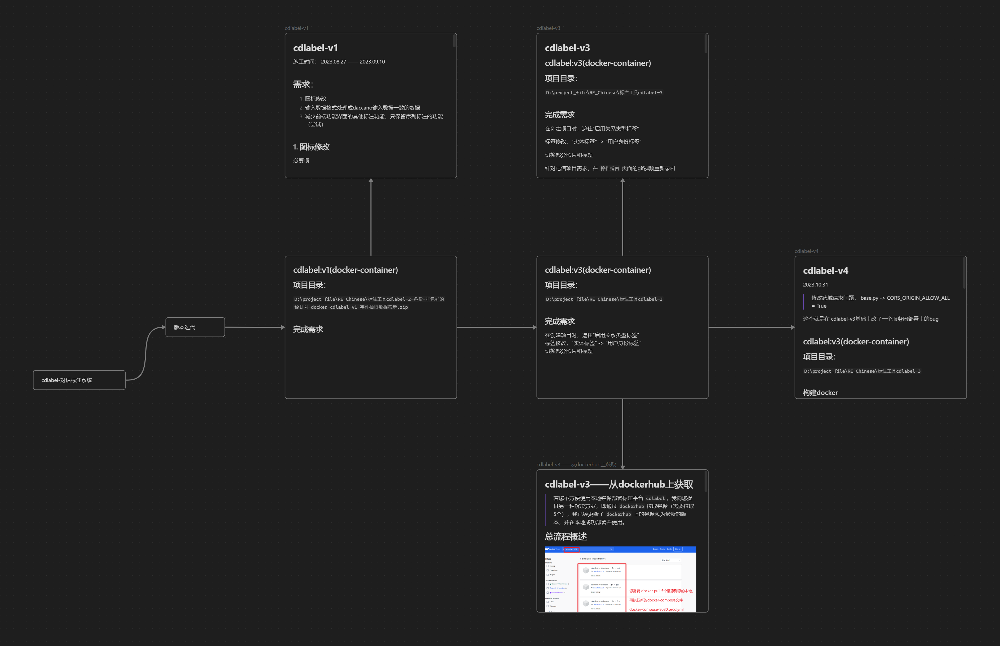

## 项目结构

前端：基于`Vue.js`和`Nuxt.js`的Javascript Web应用程序

后端：`Python`、`Django`和`Django Rest Framework`

## 基于docker的启动与首页展示

## 项目开发部分流程展示

## 总结与后续

完成甲方定制化需求，已部署到中国电信四川公司内部服务器，供公司内部人员在线标注会话人意图识别数据集。

